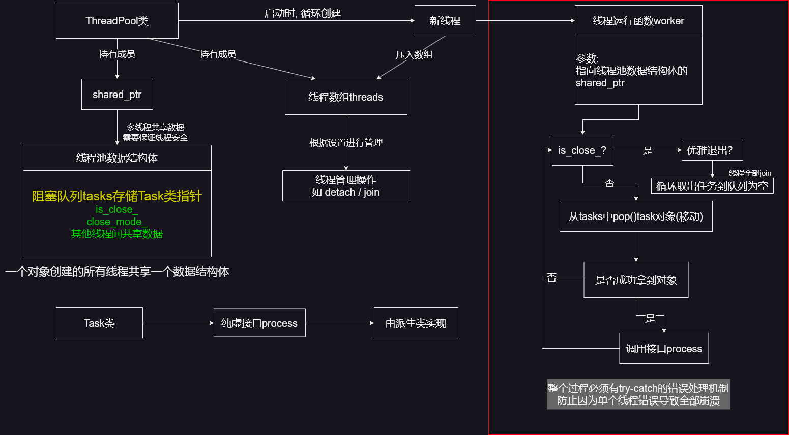

# 架构

单Reactor多线程

主线程负责监听事件，有可读或可写等事件时，放入任务队列，等待线程池处理

------


# 模块

1. **双缓冲异步日志系统 Double Buffer Asynchronous Logging System** (基本成功)
2. **线程池 Thread Pool** (基本成功)
3. **数据库连接池 Sql Connection Pool** (进行中)
4. **定时器 Timer** (计划中)
5. **Http处理器 Http Processer** (计划中)

------


# 模块详解

## 双缓冲异步日志系统


## 日志文件系统

pass


## 线程池




# 模块测评

| **模块名**         | **单元测试 Unit Test** | **基准测试Benchmark** | **评价** |
| ------------------ | ---------------------- | --------------------- | -------- |
| 双缓冲异步日志系统 | 基本成功               | 待做                  | /        |
| 日志文件系统       | 绝对能行               | 待做                  | /        |
| 线程池             | 感觉能行               | 待做                  | /        |
| 数据库连接池       |                        |                       |          |
| 定时器             |                        |                       |          |
| Http处理器         |                        |                       |          |


# 类

```c++
Buffer 缓冲区 作为其他缓冲区的基类
	主要成员变量 std::vector<char>, read_pos, write_pos (以下标index形式)
	可读区域长度 write_pos - read_pos = readable
	也就是 readable: [write_pos, read_pos)
	读写等操作通过裸指针进行 提供原始的接口 主要接口: 
                    const char* get_read_ptr(size_t& readable_len)
                    char* get_write_ptr(size_t& writable_len)
                    void set_has_written(size_t len)
                    void set_has_read(size_t len)
                    void append(const char* str, size_t len) 自动扩容
                    void clear() 归位pos 填充0
                    void reset() 归位pos 不做填充
```

```c++
FixedBuffer : public Buffer
    提供读写更好用的接口 主要作为日志缓冲区使用
    	std::string_view read(size_t len) noexcept
    	std::string_view peak(size_t len) const  noexcept
        void append_fix(const char* str, size_t len) 无安全检查 不自动扩容
```

```c++
BlockQueue 阻塞队列
    实现生产者-消费者模型 提供支持 等待超时 移动语义 的接口 主要包括:
	    bool push_back(T &&item, Ms timeout)
    	bool pop(T &item, Ms timeout)
    为了适配双缓冲异步日志系统要求的整体swap 提供如下接口
    	bool wait_for_not_empty_or_timeout(Ms timeout)
        void swap_all(std::deque<T> &out) noexcept 
    
```

```c++
AsyncLogger 异步日志
    双缓冲区异步日志
    主要成员: current_buffer next_buffer block_queue write_thread
    基本使用流程: 
		init() -> start() -> LOG_XXX() -> close()
    内置主要接口: 无安全检查 需要设置并注意写入长度
    template <LogLevel lv, bool show_time, bool show_file, 
			bool show_line, bool show_function, typename... Args>
    void log(std::source_location loc, const char *fmt, Args &&...args)    
```

```c++
LogFile 日志文件
	对ofstream进行封装 operator<<用于写入  暴露 flush 和 is_open 等接口 线程不安全
	由 私有方法 void roll_file_(size_t len) 实现 文件滚动机制 在写入时自动调用
	支持:
	一定时间间隔后滚动 一定文件大小后滚动 自动命名日志文件 日志文件续写
```

```c++
Task 任务基类 为了与线程池配合 统一接口而设计 需要被继承实现
    virtual void process() = 0;
```

```c++
ThreadPool 线程池
    主要成员:
		std::vector<std::unique_ptr<std::thread>> threads_
    	std::shared_ptr<shared_pool_data> pool_data_sptr_
    	shared_pool_data是一个包含需要线程间共享的数据的结构体
            任务队列的指针:
            std::unique_ptr<BlockQueue<std::unique_ptr<Task>>> block_queue_uptr_ 就在其中
    基本的功能:
	提供压入Task的接口 可以设置关闭模式 如优雅退出等 自由开关
	    bool add_task(std::unique_ptr<Task> task_ptr) 线程安全
        template <typename T, typename... Args>
    	bool emplace_task(Args &&...args) 线程安全
        void close() 线程不安全
        void start() 线程不安全
     由私有方法 void worker(std::shared_ptr<shared_pool_data> pool_data_sptr) 实现功能
            线程调用Task派生类的process方法处理任务
```


# C++标准库使用

```c++
多线程: thread atomic  lock  condition_variable
错误处理: assert.h
字符串处理: format string string_view sstream
系统信息: chrono source_location filesystem
输入输出 iostream fstream
容器 vector deque
算法 algorithm
测试使用 random
```


# 环境配置

```
cmake version 4.3.3
g++ (Ubuntu 14.3.0-12ubuntu1~22~ppa2) 14.3.0
```

