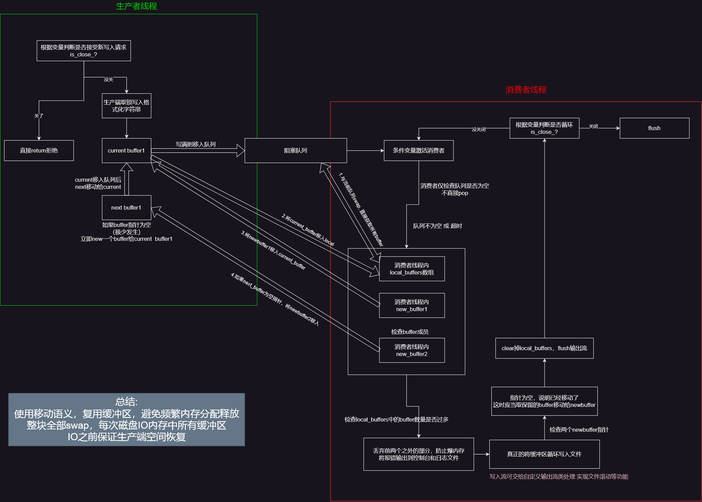

# 架构

单Reactor多线程

主线程负责监听事件，有可读或可写等事件时，放入任务队列，等待线程池处理


# 模块

1. **日志 logger**
2. **线程池 thread_pool**
3. **数据库连接池 sql_connection_pool**
4. **定时器 timer**
5. **Http处理器 httpprocesser**


# 类

```c++
Buffer 缓冲区：
	std::vector<char>, read_pos, write_pos (以下标index形式)
	可读区域长度: write_pos - read_pos = readable
	也就是: readable: [write_pos, read_pos)
	为了适配系统调用(readv 和 write), 仅提供裸指针接口
	作为 http连接缓冲区 和 日志系统缓冲区的 基类
     主要接口: 
                    const char* get_read_ptr(size_t& readable_len)
                    char* get_write_ptr(size_t& writable_len)
                    inline void set_has_written(size_t len)
                    inline void set_has_read(size_t len)
                    void append(const char* str, size_t len) 自动扩容
                    void clear() 归位pos 填充0
                    void reset() 归位pos 不做填充
```

```c++
LogBuffer : public Buffer
    提供 read, peak, write 接口 读写更好用
    	std::string_view read(size_t len)
    	std::string_view read()
    	std::string_view peak(size_t len)
    	std::string_view peak()
    	void write(const char* str, size_t len)
```

```c++
BlockQueue 阻塞队列
    实现生产者消费者模型
```

```c++
AsyncLogger 异步日志
    双缓冲区异步日志
    主要成员: current_buffer next_buffer block_queue_ write_thread
    基本工作流程: 
		外部调用getInstance()->init()完成初始化
         外部调用 LOG_INFO 等inline函数写日志
```

```c++
LogFile 日志文件
	对ofstream进行封装 封装operator<<用于写入  暴露 flush 和 is_open 等接口 线程不安全
	主要功能由 私有方法inline void roll_file_(size_t len); 实现文件滚动机制 在写入时自动调用
	支持:
	一定时间间隔后滚动 一定文件大小后滚动
	自动命名日志文件 日志文件续写
```


# 模块详解

## 双缓冲异步日志系统




# C++标准库使用

std::print (C++23)

std::thread (C++11)

atomic  lock  condition_variable等

assert